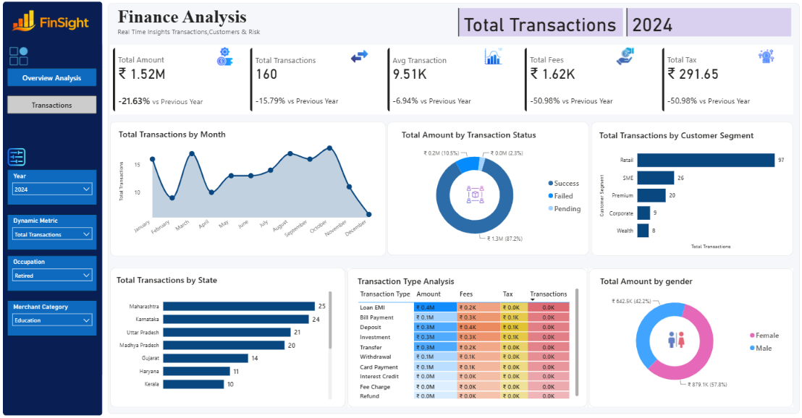
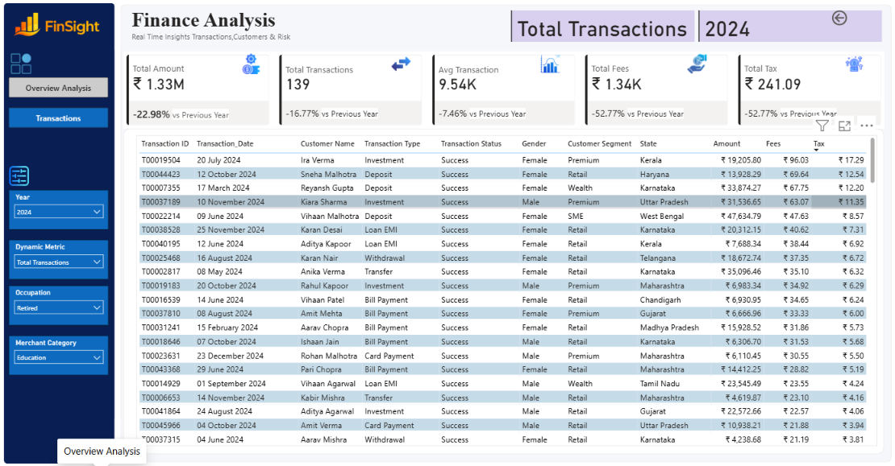

# Finance Analysis Dashboard | Power BI

An interactive Finance Analytics Dashboard built in Power BI to analyze financial transactions, customer behavior, transaction performance, fees, taxes, and customer segments.

The project was developed based on business requirements focused on monitoring transaction performance and providing detailed views for further analysis.

---

## 📊 Project Overview

The objective of this project is to provide a centralized dashboard for analyzing financial transactions across different years, customer segments, states, occupations, merchant categories, transaction types, and customer demographics.

The dashboard contains two main pages:

- **Overview Analysis** – High-level financial and transaction analysis
- **Transactions** – Detailed transaction-level view with drillthrough functionality

The dashboard focuses on transaction growth, monthly trends, transaction status, customer segments, state-wise performance, transaction types, gender-based analysis, fees, and taxes.

---

## 🎯 Business Requirements

The dashboard was designed to address the following business requirements:

- Monitor overall transaction and financial performance
- Analyze monthly transaction trends
- Compare successful, failed, and pending transactions
- Analyze customer segment contribution
- Compare transaction performance across states
- Analyze transaction types
- Track fees and taxes
- Understand customer demographics
- Analyze transaction patterns using interactive filters
- Provide detailed transaction-level information

---

## 📌 Key Performance Indicators

The dashboard includes the following KPIs:

- **Total Amount**
- **Total Transactions**
- **Average Transaction Value**
- **Total Fees**
- **Total Tax**

These KPIs provide a quick overview of overall transaction activity and financial performance.

---

## 🎛️ Interactive Filters

The dashboard allows users to filter the analysis using:

- **Year**
- **Dynamic Measure**
- **Occupation**
- **Merchant Category**

These filters allow different parts of the dashboard to be explored based on the selected criteria.

---

## 🔄 Dynamic Metric Analysis

A dynamic metric selector was created to allow selected visuals to switch between different measures.

The available metrics include:

- Total Amount
- Total Fees
- Total Tax
- Total Transactions

This allows the same visual to be used for different types of financial analysis without creating separate charts for every metric.

---

## 📈 Dashboard Analysis

### 1. Monthly Trend Analysis

An area chart is used to analyze the selected transaction metric over time.

This helps identify changes in transaction activity across different months.

### 2. Transaction Status Analysis

A donut chart compares transaction amounts based on transaction status:

- Success
- Failed
- Pending

This provides a view of how transaction amounts are distributed across different transaction outcomes.

### 3. Customer Segment Analysis

A horizontal bar chart compares transaction amounts across customer segments:

- Retail
- Premium
- SME
- Corporate
- Wealth

This helps analyze the contribution of different customer groups.

### 4. State-wise Analysis

A horizontal bar chart compares transaction amounts across different states.

This provides a geographical view of transaction performance.

### 5. Transaction Type Analysis

A detailed table provides analysis by transaction type using:

- Amount
- Fees
- Tax
- Transaction Count

The transaction types include:

- Bill Payment
- Card Payment
- Deposit
- Fee Charge
- Interest Credit
- Investment
- Loan EMI
- Refund
- Transfer
- Withdrawal

### 6. Gender Analysis

A donut chart compares transaction amount contribution by gender.

This provides an additional demographic view of transaction activity.

---

## 🔎 Detailed Transactions

The second dashboard page provides a detailed transaction-level view.

The table includes information such as:

- Transaction ID
- Transaction Date
- Customer Name
- Transaction Type
- Transaction Status
- Gender
- Customer Segment
- State
- Total Amount
- Total Fees
- Total Tax

The page also supports **drillthrough navigation**, allowing the user to move from the overview analysis to detailed transaction records.

---

## 🗂️ Dataset

The project uses two datasets.

### Finance Transactions

The transaction dataset contains fields including:

- Transaction ID
- Transaction Date
- Account ID
- Customer ID
- Transaction Type
- Channel
- Merchant Category
- Amount
- Fee Amount
- Tax Amount
- Currency
- Transaction Status
- Fraud Indicator
- Risk Score
- Reference Number

### Customers

The customer dataset contains fields including:

- Customer ID
- First Name
- Second Name
- Gender
- Date of Birth
- City
- State
- Occupation
- Customer Segment
- Annual Income
- Join Date

The datasets are connected using **Customer ID**.

---

## 🧹 Data Preparation

Power Query was used for data preparation before building the dashboard.

The transaction and customer datasets were combined through the Power BI data model to allow transaction performance to be analyzed alongside customer information such as:

- Customer Segment
- Occupation
- Gender
- State
- Merchant Category

---

## 🧮 DAX

DAX measures were used to calculate the main dashboard metrics and support the interactive analysis.

The dashboard uses measures for:

- Total Amount
- Total Transactions
- Average Transaction Value
- Total Fees
- Total Tax
- Dynamic Metric Selection

---

## 🛠️ Tools & Technologies

- **Power BI Desktop**
- **Power Query**
- **DAX**
- **CSV**

---

## 📑 Dashboard Structure

### Page 1 — Overview Analysis

The overview page contains:

- KPI cards
- Monthly trend analysis
- Customer segment analysis
- State-wise analysis
- Transaction status analysis
- Gender analysis
- Transaction type analysis
- Interactive slicers
- Dynamic metric selection

### Page 2 — Transactions

The transactions page contains:

- Detailed transaction records
- Customer information
- Transaction information
- Financial metrics
- Drillthrough functionality
- Navigation back to the overview page

---

## 🖼️ Dashboard Preview

### Overview Analysis



### Transactions



---

## ❓ Business Questions Addressed

The dashboard helps answer questions such as:

- What is the total transaction amount?
- How many transactions were performed?
- What is the average transaction value?
- How much fee and tax were generated?
- How does transaction activity change over time?
- How are transaction amounts distributed by status?
- How do different customer segments contribute to transaction value?
- How does transaction activity vary across states?
- How do transaction types compare based on amount, fees, tax, and transaction count?
- How does transaction activity differ by gender?
- What are the underlying details of individual transactions?

---

## 📁 Repository Structure

```text
Finance-Analysis/
│
├── Finance Analysis.pbix
├── README.md
│
├── data/
│   ├── finance_transactions.csv
│   └── customers_sample.csv
│
└── images/
    ├── overview.png
    └── transactions.png# Finance-Analysis
